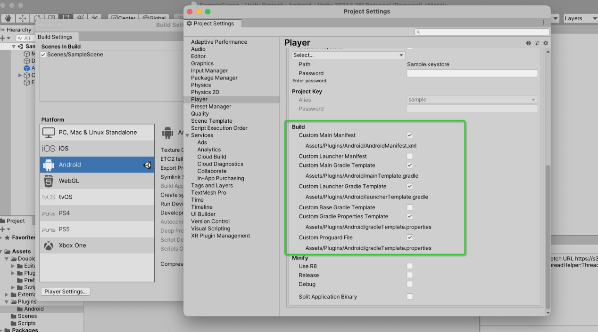
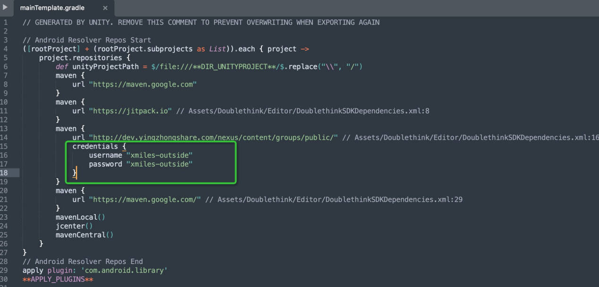
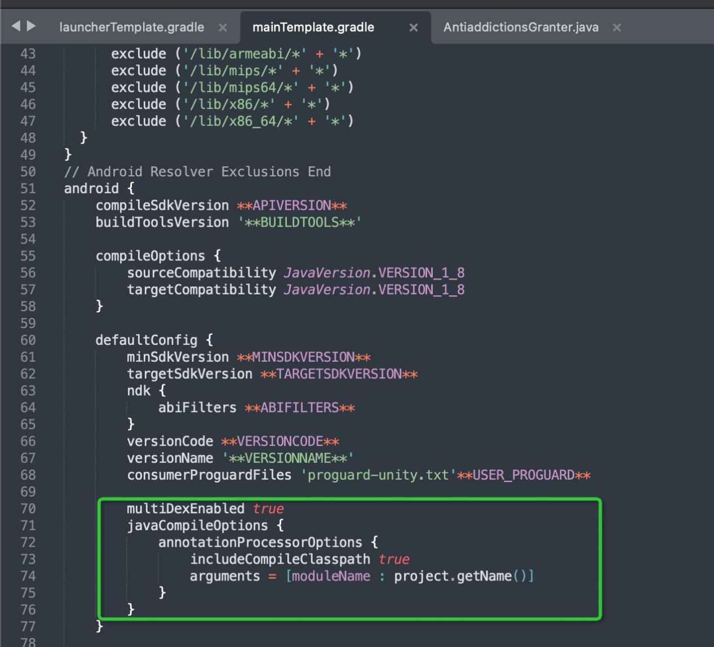
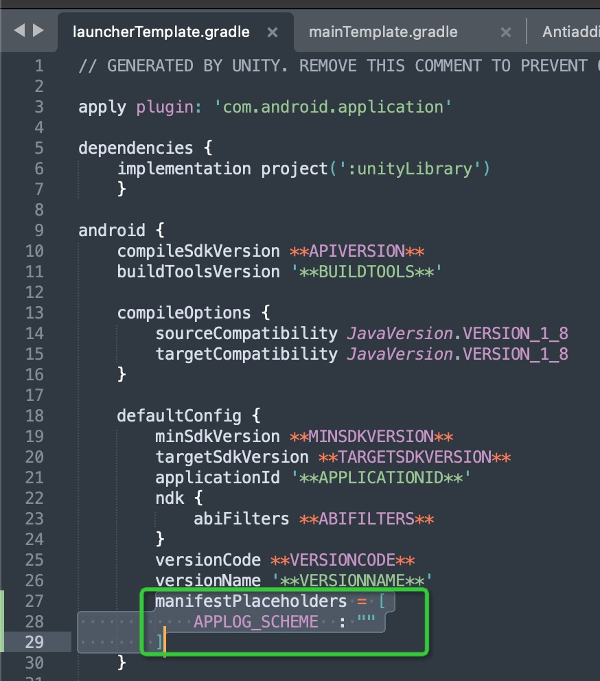
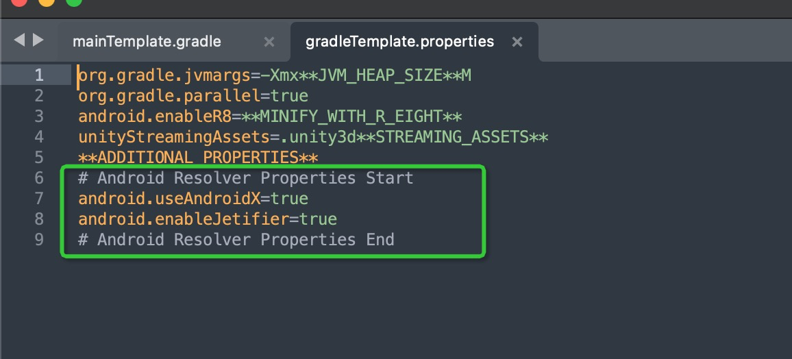
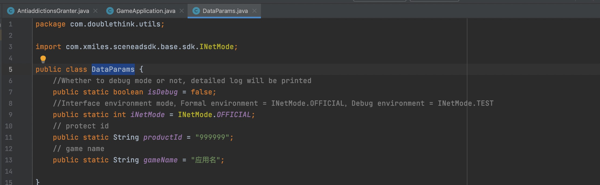
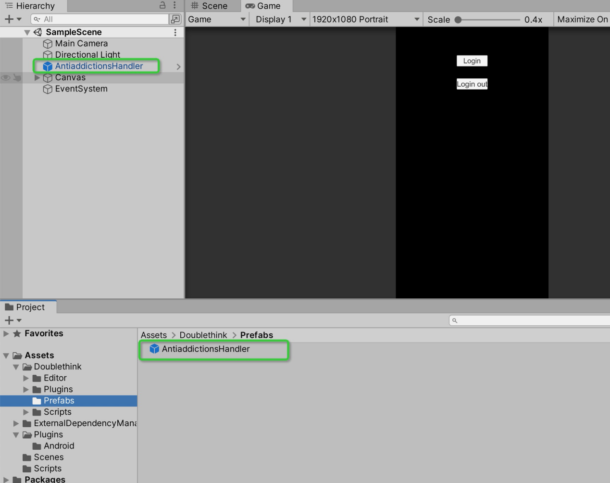

# Doublethink Games Anti Addiction plugin for Unity
_Copyright (c) 2021 Doublethink Inc. All rights reserved._

The Doublethink Games Anti Addiction plugin for Unity&reg; is an open-source project whose goal 
is to provide a plugin that allows game developers to integrate with 
the Doublethink Games API from a game written in Unity&reg;. However, this project is 
not in any way endorsed or supervised by Unity Technologies.

_Unity&reg; is a trademark of Unity Technologies._

_iOS is a trademark of Apple, Inc._

## Overview

The Doublethink Games plugin for Unity allows you to access the Doublethink Games 
Anti Addiction API through Unity's Anti Addication interface. 
The plugin provides support for the following features of the Doublethink Games Anti Addiction API:<br/>

* sign in
* sign out
* events

__NOTICE__: This version of the plugin no longer supports iOS.

Features:
* easy GUI-oriented project setup (integrated into the Unity GUI)
* no need to override/customize the player Activity
* no need to override/customize AndroidManifest.xml

System requirements:

* Unity&reg; 2017.4 or above

* To deploy on Android:
	* Android SDK
	* Android v5.0 or higher

## Upgrading

If you have already integrated your project with a previous version of the
plugin and wish to upgrade to a new version, please refer to the
[upgrade instructions](UPGRADING.txt).

## Plugin Installation

To download the plugin, clone this Git repository into your file system (or download it as
a ZIP file and unpack it). Then, look for the **unitypackage** file in
the **current-build** directory:
	
	current-build/DoublethinkGamesPluginForUnity-X.YY.ZZ.unitypackage

To install the plugin, simply open your game project in Unity and import that file into
your project's assets, as you would any other Unity package. This is accomplished through
the **Assets > Import Package > Custom Package** menu item (you can also reach this menu it
by right-clicking the **Assets** folder).

Next, make sure your current build platform is set to **Android**. From
**File > Build Settings…** select **Android** and click **Switch Platform**.

## Android Setup

Next, set up the path to your Android SDK installation in Unity. This is located in the
preferences menu, under the **External Tools** section.

configure your game's package name. To do this, click **File > Build Settings**,
select the **Android** platform and click **Player Settings** to show Unity's
Player Settings window. In that window, look for the **Bundle Identifier** setting
under **Other Settings**. Enter your package name there (for example
_com.example.my.awesome.game_).


In order to log in to Doublethink Game Services，you need to set up AndroidManifest and gradle。



The DoublethinkGamesPluginForUnity-X.YY.ZZ Unity plugin is distributed with the Unity Play Services Resolver library. 
This library is intended for using by any Unity plugin that requires access to Android 
specific libraries (e.g., AARs) or iOS CocoaPods. It provides Unity plugins 
the ability to declare dependencies, which will automatically resolved and copied into your Unity project

## Configure Your Game

To use the plugin,you must first obtain the **product id from Doublethink related personnel**
 to configure your game.Be particularly careful when entering your package name and your
product id,since mistakes on those screens can be difficult to
recover from.

In the Unity editor, select **Assets > External Dependency Manager > Android Resolver > Resolve.**
The Unity External Dependency Manager library will copy the declared dependencies into 
the **Assets/Plugins/Android/mainTemplate.gradle** directory of your Unity app.

_NOTICE__:The **DoublethinkGamesPluginForUnity-X.YY.ZZ** Unity plugin 
dependencies are listed in **Assets/Doublethink/Editor/DoublethinkSDKDependencies.xml**

Open **Asstes/Plugins/Android/mainTemplate.gradle** file specify the location and add the following.

```csharp
	credentials {
	    username "xmiles-outside"
	    password "xmiles-outside"
	}
```



```csharp
	multiDexEnabled true
    javaCompileOptions {
        annotationProcessorOptions {
        	includeCompileClasspath true
        	arguments = [moduleName : project.getName()]
        }
    }
```



Open **Asstes/Plugins/Android/launcherTemplate.gradle** file specify the location and add the following.

```csharp
	manifestPlaceholders = [
            APPLOG_SCHEME  : ""
        ]
```



Open **Asstes/Plugins/Android/gradleTemplate.properties** file specify the location and add the following.

```csharp
	**# Android Resolver Properties Start**
	android.useAndroidX=true
	android.enableJetifier=true
	**# Android Resolver Properties End**
```



## Configuration & Initialization Doublethink Services

For the progress of the game or the normal minors to prevent addiction, 
the configuration needs to be replaced with game parameters. To do this, 
please open the following file to configure the parameters.

Open ** Asstes/Doublethink/Plugins/Android/doublethink/utils/DataParams.java



Asstes/Doubletink/Prefabs/AntiaddictionHandler.prefab Add to your main scene.
_NOTICE__:This prefab integrates content that interacts with android



## Sign in

Log in to the interface and return bool type parameters, true means logged in success, false means not logged in

```csharp
	//is auto sign in，default parameter false.will not automatically log in
	AntiaddictionsHandler.Instance.Login(Boolean isAutoLogin);
```

## Sign out

To sign the user out

```csharp
	AntiaddictionsHandler.Instance.LoginOut();
```

## Listen for events
Listen for these events by registering a delegate for the appropriate EventHandler, as shown below.

```csharp
	private void Awake(){
		//Called when an login success
		AntiaddictionsHandler.OnLoginSuccessFinished+=OnLoginSuccessFinishedHandle;
		//Called when an refister success
		AntiaddictionsHandler.OnRegisterSuccessFinished+=OnRegisterSuccessFinishedHandle;
		//Called when an login failed
		AntiaddictionsHandler.OnLoginFailedFinished += OnLoginFailedFinishedHandle;
		//Called when an logout success
		AntiaddictionsHandler.OnLoginOutSuccessFinished+=OnLoginOutSuccessFinishedHandle;
		//
		AntiaddictionsHandler.OnOpenAgreementLink += OnOpenAgreementLinkHandle;
	}

	/*
	//type.userId = Return to the logged-in account
	//type.isAdult = Return whether adult
	//type.userDeviceId = Return to the devices id after logging in
	//type.UserToken = Return the token after login
	*/
	private void OnLoginSuccessFinishedHandle(AntiadictiionsType type)
	{
    	Debug.Log("Sample login success: " + type.userId+","+type.isAdult+","+type.userDeviceId+","+type.UserToken);
	}

	private void OnRegisterSuccessFinishedHandle()
	{
    	Debug.Log("Sample register success");
	}
	private void OnLoginFailedFinishedHandle(string result)
	{
    	Debug.Log("Sample login failed: " + result);
	}
	private void OnLoginOutSuccessFinishedHandle()
	{
    	Debug.Log("Sample login out success");
    	_loginButton.gameObject.SetActive(true);
	}
	/*
	//linkEnum == AgreementLinkEnum.UserAgreement//You need to jump to the specified link address,service agreement link
	//linkEnum == AgreementLinkEnum.PrivacyAgreement//You need to jump to the specified link address,privacy policy link
	*/
	private void OnOpenAgreementLinkHandle(AgreementLinkEnum linkEnum)
	{
		Debug.Log("Sample open agreement link: " + linkEnum.ToString());
	}
```
